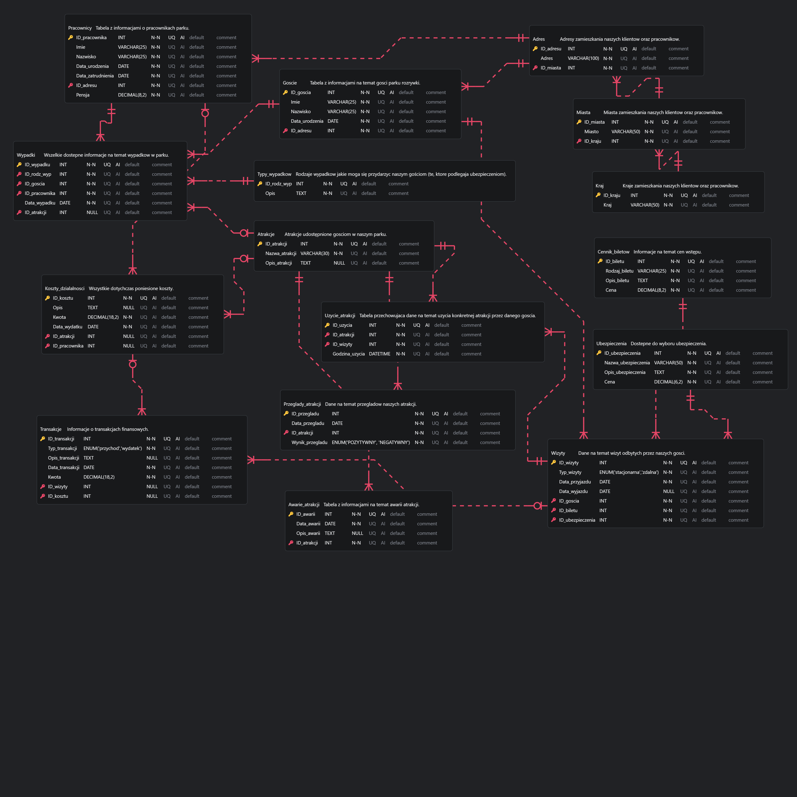

# Projekt bazy danych dla parku rozrywki

Projekt został wykonany w ramach zaliczenia przedmiotu akademickiego w zespole 3 osób:
- Katarzyna Bednarkiewicz
- Ewelina Dąbrowa
- Marcela Nieto-Kuczyńska

## Mój wkład

Mój wkład w projekt obejmował:
- przygotowanie skryptów Python do generowania danych,
- tworzenie zapytań SQL oraz analizę danych zapisanych w bazie,
- przygotowanie raportu końcowego w R Markdown.

## Opis projektu

Projekt obejmuje zaprojektowanie i implementację relacyjnej bazy danych dla parku rozrywki oraz przeprowadzenie analizy danych dotyczących funkcjonowania obiektu.

Zakres projektu:
- zaprojektowanie schematu relacyjnej bazy danych (ERD),
- normalizacja bazy danych do postaci EKNF,
- implementacja bazy danych w MariaDB,
- wygenerowanie realistycznych danych przy użyciu języka Python,
- analiza danych z wykorzystaniem SQL oraz biblioteki Pandas,
- przygotowanie wizualizacji w Matplotlib i Seaborn,
- przygotowanie raportu końcowego w R Markdown.

## Wykorzystane technologie

### Baza danych
- MariaDB / MySQL
- XAMPP

### Języki programowania
- Python
- SQL
- R

### Biblioteki Python
- pandas
- mysql-connector-python
- matplotlib
- seaborn
- Faker
- random
- datetime
- python-dateutil

### Biblioteki R
- knitr

## Struktura projektu

```
baza.sql                     - tworzenie struktury bazy danych
zapytania.sql                - pomocnicze zapytania SQL
dane_wygenerowane.sql        - wygenerowany zbiór danych w formacie SQL służący do zasilenia bazy
generator_danych.py          - generowanie krajów, miast, adresów, cennika i ubezpieczeń
generator_danych_2.py        - generowanie pracowników, gości i działalności parku
analiza.py                   - analiza danych oraz generowanie wykresów
Raport.Rmd                   - kod raportu
Raport.pdf                   - wygenerowany raport
schemat_bazy.png             - schemat bazy danych
wyniki_analiza/              - pliki CSV i wykresy wygenerowane przez analizę
```

## Uruchomienie projektu

Projekt wykorzystuje lokalne środowisko XAMPP oraz bazę MariaDB.

Konfiguracja połączenia:

- Host: localhost
- Port: 3306
- Użytkownik: root
- Hasło: (puste)

Kolejność uruchamiania:

1. `baza.sql`
2. `generator_danych.py`
3. `dane_wygenerowane.sql`
4. `generator_danych_2.py`
5. `analiza.py`
6. `Raport.Rmd`

## Schemat bazy danych



Baza została zaprojektowana jako relacyjna i znormalizowana do postaci EKNF.

## Analiza danych

Raport obejmuje analizę:

- rentowności atrakcji,
- wyniku finansowego parku,
- trendu przychodów, kosztów i zysków,
- bezpieczeństwa atrakcji,
- sprzedaży biletów,
- liczby odwiedzających,
- demografii gości,
- lojalności klientów,
- pochodzenia geograficznego odwiedzających.

Pełne wyniki znajdują się w pliku **Raport.pdf**.
